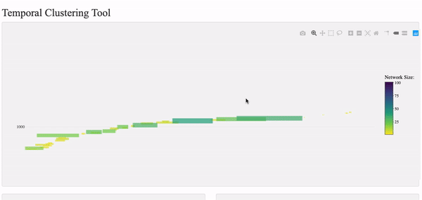

## Instructions for the Temporal Clustering Tool

This application is an attempt to make the [temporal clusters generated
by Sebastian’s
code](http://emlonetworks.pythonanywhere.com/static/TEMPORAL/index.html)
easier to filter and navigate. Sebastian can explain the method in more
detail, but essentially the clusters are looking for ‘conversations’:
unusually intense bursts of communication among a group in a short space
of time.

#### Application Overview

The application can be found at
<https://networkingarchives.shinyapps.io/temporal_clusters>. When it
first loads (this takes a couple of seconds) you’ll be presented with
four separate windows. Some of these are empty until data is selected.
These are:

-   The timeline view
-   The search and filter window
-   The network window
-   The text info window

#### Timeline view:

The most important is the timeline. By default this displays every
detected temporal cluster in the data as a coloured bar. The bars are
visualised in date order. The height of the bar (and the colour)
indicates the number of individuals in the network, and the length of
the bar corresponds to the time between the first and last letters
included in the cluster. Hovering over a bar (actually, you need to
hover over one of the ends) will display some additional information in
a pop-up box, intended to give some clues as to what the cluster might
be ‘about’:

-   The first 10 individuals. If there are less than ten in total, the
    rest will be filled in with ‘NA’.

-   The six most ‘significant’ words. Most significant here is
    calculated by scoring each word on how often it appears in this
    cluster, *in comparison to other clusters*. So it should highlight
    words that appear unusually often in a given cluster.

This is meant as a way to help guide users to relevant clusters, rather
than act as an analysis on its own.

##### Zooming and Panning the Timeline View

The timeline window is also an interactive graphic, designed to help
focus in on certain clusters. There are a number of controls in the
top-right corner (highlighted in red above). Hovering over them will
display what they do. From the left, the first allows you to download
the current plot as a picture. The next four are options for what
happens when you click and drag on the plot - either zoom, pan (move
side to side without zooming), or select (not used here). The next two
are an alternative zoom method, using plus and minus buttons, and the
two after that (the picture of the house and the one before) allow you
to reset the zoom back to the original, very useful if you get ‘lost’ in
the plot.

As there are a large number of of bars (over 2,800), the zoom is
particularly useful to narrow down a search to a particular timespan.
Make sure the zoom option is selected (second icon from the left), and
click and drag over an area of interest:

When you let go, it will zoom in on that area of the graph.

You should now be able to distinguish between individual clusters. You
can zoom in again if it’s still not clear.

Once you’re happy with the level of zoom, you can use the pan tool to
navigate your way through the clusters. To do this switch to the pan
tool (to the right of the zoom) and then click and drag on the graph,
hovering over the individual clusters to display their top people/words:

#### Search and Filter Window

Another way to narrow down from the full list of clusters is to use the
search and filter tools. These are fairly self-explanatory: type a word
into the search box and hit return/Search and it will only display
clusters where that word appears at least once in the abstracts. The
search (and in particular the reset button) can be a bit slow so you
might have to be patient:

The filter is a drop-down containing any name appearing in the clusters.
By default, all names are selected. You can filter to just display
clusters where certain individuals appear. At the moment, it’s an ‘OR’
filter - so if you select two individuals, it’ll display any cluster
where either of them appears.

The best way to use it is to select a single individual. Click the
drop-down, then the ‘Deselect’ button to deselect all names. Next, click
into the search bar and start typing - when the relevant name appears,
click on it to filter the clusters:

#### Network Window

Once you’ve found a cluster (or clusters) of interest, you can explore
them with the final two windows. First up is the network window. To
display something here, click on a cluster to select it. This will
produce a network visualisation of the cluster. It is interactive - you
can zoom using your scroll wheel, click and drag to move around within
it, and even move the nodes themselves:

#### The Text Window

The final window allows you to explore the documents which make up the
cluster, to determine the extent to which it is a cohesive
‘conversation’. It’s actually made up of three separate tabs:

-   ‘Significant words’ is a word cloud of the most significant/unique
    words (calculated as explained above).

-   ‘By date’ will display all the documents which make up that cluster,
    in date order.

-   ‘Selected edge’ will display all documents between a chosen pair. To
    do this, click on an edge in the network window view, like this:

    
